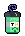
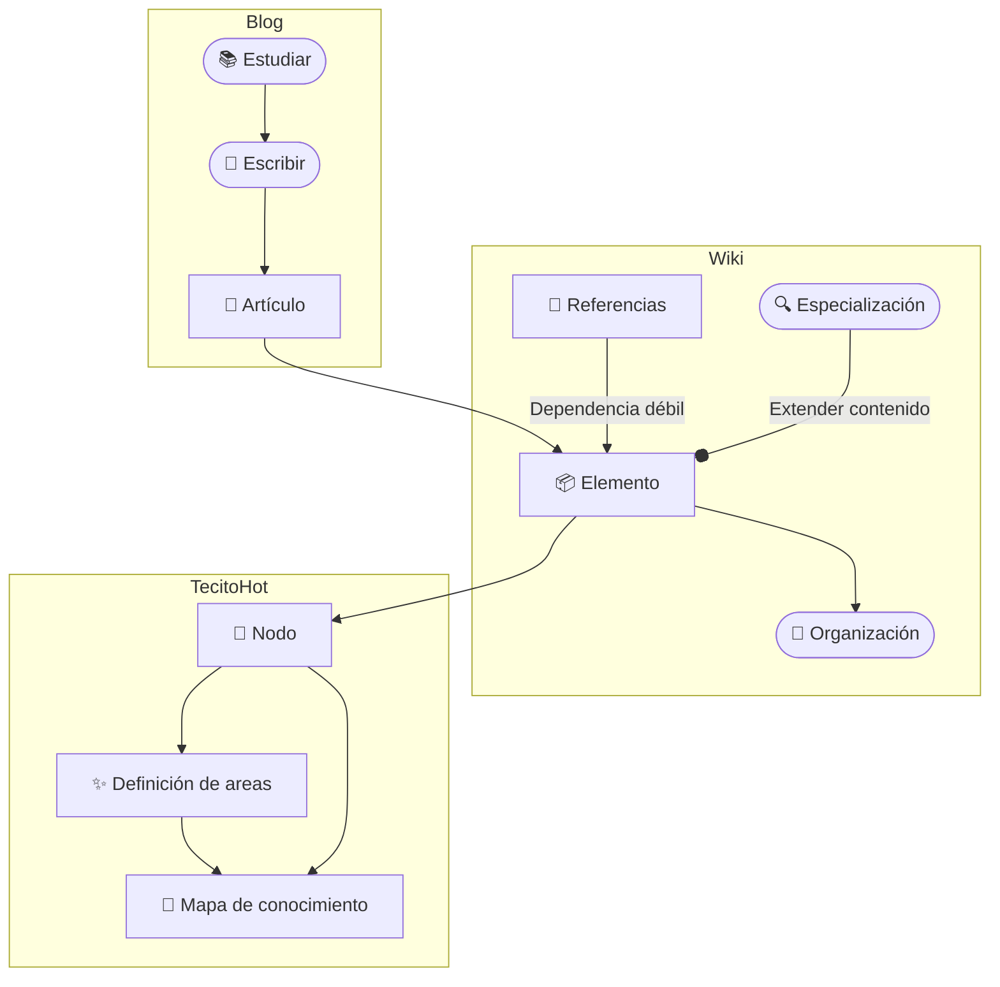

<p align='center'>
    
</p>
<h1 align='center'>TecitoHot</h1>
<p align='center'>
    <a href='./docs/README.md'>
        
    </a>
    <a href='#'>
        
    </a>
</p>

> 🗃️ **Blog de informática**: programación teórica y práctica de forma simplificada.

## 🚀 Estructura de proyecto

Dentro del proyecto se encuentra la siguiente estructura de archivos:

```text
/
├── docs/
├── public/
├── src/
│   ├── assets/
│   ├── components/
│   ├── layouts/
│   ├── content/
│   └── pages/
│       └── index.astro
└── package.json
```

Lo relevante se encuentra en la carpeta `src/content`, donde se encuentran los archivos `.mdx` que contienen el contenido del blog.

Es posible leer la documentación completa en [este enlace](./docs/README.md) o directamente en la carpeta `docs` para saber el proceso de desarrollo del proyecto.

## 🔥 Motivaciones

**TecitoHot** nace el 2022 con la idea de ser un proyecto personal para tener apuntes de la universidad, cosa que se veía difícil de hacer con HTML, CSS y Vanilla JS, además de no conocer herramientas más sofisticadas como [Notion](https://www.notion.so/), [Obsidian](https://obsidian.md/) o el propio Markdown.

Con el tiempo, desee compartir mis apuntes con el mundo, **cosas que me costaron bastante en buscar y simplificar**, para que otros estudiantes puedan acceder directamente a la información y no perder tiempo en buscarla en internet o en libros que difícilmente se encuentran.

El proyecto fracasó en sus primeras versiones, por mi propia falta de conocimiento para implementar la idea. Actualmente, se busca retomar el proyecto con un enfoque más profesional y con la idea de escalar a una plataforma de aprendizaje.

> Ser la plataforma más grande de aprendizaje teórico en español 🚀

> [!NOTE]
> Actualmente, el proyecto es una escusa para crear videos en [@RepolloDev](https://www.youtube.com/@RepolloDev), siendo que deseo que cada video tenga un contenido escrito y organizado, para que el espectador pueda acceder a la información de forma rápida y sencilla.

## 👀 A donde vamos a llegar?

**TecitoHot** comienza por la idea de ser un blog de informática para compartir lo que se aprende en la universidad y en la vida diaria, pero se busca escalar a una plataforma de aprendizaje.



Como visión a futuro, el proyecto busca evolucionar a un **mapa de conocimiento**, siguiendo la idea de [Obsidian](https://obsidian.md/) con su sistema de nodos y enlaces, pero con un enfoque por capas y especialización de contenido, de manera que se cumplan con los requisitos:

- [ ] **Capas**: contenido dividido en capas, de forma que se pueda entender de forma general y especializada.
  - [ ] **Simplificado**: contenido corto y fácil de entender, documentos totalmente independientes.
  - [ ] **Especialización**: contenido especializado, la capa más profunda donde se realiza un análisis más detallado de un solo tema.
- [ ] **Organización**: el contenido debe estar organizado de varias formas posibles, para su lectura de diferentes perspectivas para el lector.
  - [ ] **RoadMap**: el contenido debe tener una jerarquía de temas, de forma que se pueda seguir un camino de aprendizaje.
- [ ] **Grafo**: el contenido se representa como un grafo, donde cada _colección de nodos_ (clase) tiene una sinergia entre sí.
  - [ ] **Dependencia fuerte**: el contenido especializado depende de otros _nodos_, de forma que no tenga redundancia y se pueda navegar de forma sencilla.
  - [ ] **Dependencia débil**: el contenido general depende de otros _nodos_, de forma que se pueda especializar el contenido.

### 🚧 Limitaciones

El proyecto se encuentra en una fase temprana de desarrollo, pero actualmente se enfrente a las siguientes limitaciones:

- **💨 Falta de contenido**: para llegar la siguiente fase es necesario tener mucho contenido, por lo que se necesita tiempo para escribir y revisar.
- **⌛ Especialización**: el crear contenido especializado es un reto, ya que se necesita un estudio más profundo, además de la relación con otros documentos.
- **📚 Organización**: la organización final a la que se quiere llegar requiere analizar la mejor forma de agrupar el contenido.
- **⛄ Contenido estático**: el contenido es estático, por lo que a futuro se necesita una forma de actualizar el contenido de forma dinámica y almacenar en una base de datos.

Cada una de estas razones desencadenan en más limitaciones, sobre todo la parte de la organización, ya que es necesario tener una base de información solida para comenzar a organizar el contenido.

> No se puede jugar sin juguetes 🧸
